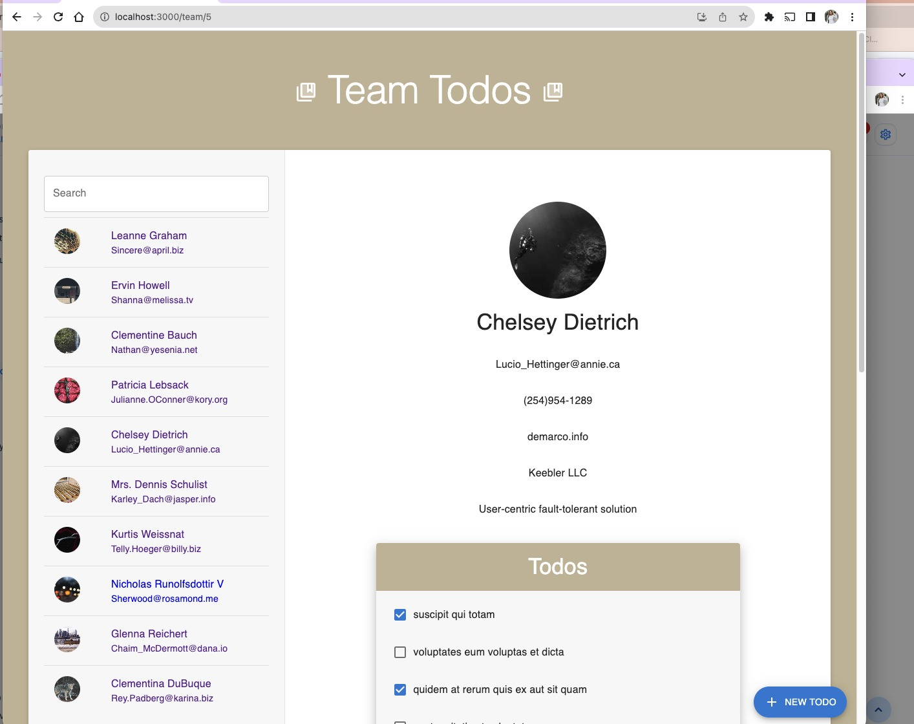

# Team Todos

Team Todos is a task management application designed for a group of people to keep track of their tasks seamlessly. 


## Features

- **User Profiles**: Detailed profiles of team members.
- **Todos Management**: Create, view, and update TODOs for each team member.
- **Material Design**: A user-friendly interface that looks great.

## Prerequisites

- Node.js & npm

## Getting Started

1. **Clone the repository**
    ```bash
    git clone https://github.com/adeiye11/team-todos.git
    cd team-todos
    ```

2. **Install dependencies**
    ```bash
    npm install
    ```

4. **Run the application**
    ```bash
    npm start
    ```

## Deployment

This is deployed on Render and can be found at https://team-todos.onrender.com/
